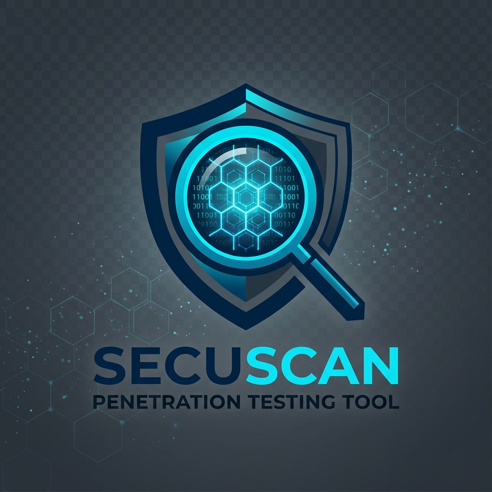
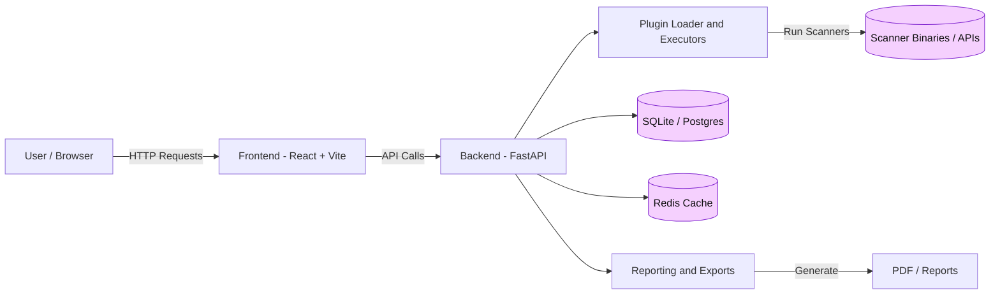

<p align="center">
  
</p>

<h1 align="center">
  🛡️ SecuScan
</h1>

<p align="center">
  <strong>
    Local-first security scanning platform for learning, experimentation,
    and ethical pentesting workflows.
  </strong>
</p>

<p align="center">
  Built for developers, cybersecurity learners, and ethical hackers who want
  fast, privacy-focused, and modern vulnerability scanning tools.
</p>

---

<p align="center">

  <a href="https://github.com/utksh1/SecuScan/blob/main/LICENSE">
    
  </a>

  <a href="https://www.python.org/downloads/">
    
  </a>

  <a href="https://github.com/utksh1/SecuScan/tree/main/frontend">
    
  </a>

  <a href="https://github.com/utksh1/SecuScan">
    
  </a>

  <a href="#">
    
  </a>

</p>

---

<p align="center">
  🚀 Fast Scanning • 🔒 Privacy Focused • ⚡ Lightweight • 🧠 Learning Friendly
</p>

---

## 🎯 Project Purpose

> NOTE: Detailed setup, deployment, and contributor onboarding content has been moved to the `docs/` folder to keep this README clean and concise.
> See [Installation and Setup](docs/installation.md) and [Contributing](docs/contributing.md) for complete guides.

SecuScan is an open-source, plugin-driven security scanning platform built for learning, experimentation, and ethical security workflows. It combines a powerful FastAPI backend, a modern React frontend, and an extensible plugin ecosystem for recon, web, cloud, container, and reporting operations.

The project is designed to be:

- 🔒 **Local-first** — Scan data remains on infrastructure you control, ensuring better privacy and security.
- 🤝 **Contributor-friendly** — Frontend, backend, plugins, and documentation all provide clear and accessible contribution entry points.
- 🛡️ **Safety-aware** — The platform promotes ethical, educational, and responsible cybersecurity practices.

---
## 👥 Who It Is For

- 🎓 **Students & GSSoC Contributors** — Gain hands-on experience by contributing to a real-world, full-stack open-source cybersecurity platform.
- 🛡️ **Security Learners** — Explore security workflows through an intuitive UI-driven toolkit instead of relying solely on raw CLI tools.
- ⚙️ **Developers & Researchers** — Extend scanners, parsers, reporting systems, and automation workflows with a modular plugin-based architecture.

---

## 🚀 Core Areas

- 🔗 **Scan Orchestration & API Workflows**
  Backend services and scanning pipelines inside `backend/secuscan`
- 🖥️ **React Frontend & Dashboard Experience**
  Modern UI components, dashboard interactions, and user workflows in `frontend/src`
- 🔌 **Plugin System & Parser Integrations**
  Scanner plugins, metadata handling, and parsing utilities inside `plugins`
- 📊 **Reports, Exports & Result Normalization**
  Unified reporting, export generation, and scan result processing across backend and frontend 

  ---

## Architecture Diagram

---

## 🗂️ Repository Structure

| 📁 Directory | 📄 Description |
|---|---|
| `backend/` | FastAPI backend and scan workflows |
| `frontend/` | React + Vite frontend application |
| `plugins/` | Scanner plugins and parser integrations |
| `testing/backend/` | Backend tests and validation scripts |
| `frontend/testing/` | Frontend unit and E2E tests |
| `docs/` | Project documentation and guides |
| `scripts/` | Utility and maintenance scripts |

---

## Prerequisites

For a fresh local setup, make sure your machine has:

- `python3` 3.11 or newer
- Node.js 20 or newer
- npm 10 or newer
- Docker Desktop or Docker Engine if you want the Compose workflow

If your machine has multiple Python versions installed, `./setup.sh` now looks for a compatible `python3` automatically. You can also force one explicitly with `PYTHON=/path/to/python3.11 ./setup.sh`.

The scripted local setup path was re-checked from a fresh clone with a compatible Python 3.11+ interpreter.
# 🚀 Quick Start

Choose one of the following local development workflows to get SecuScan running.

---

## 🖥️ Option 1 — Simple Local Development

The fastest setup path for frontend, backend, and contributor workflows from a fresh clone.

```bash
git clone https://github.com/utksh1/SecuScan.git
cd SecuScan

chmod +x setup.sh start.sh

./setup.sh
./start.sh
```

### 🔗 Available Services

| Service | URL |
|---|---|
| Frontend | `http://127.0.0.1:5173` |
| Backend API | `http://127.0.0.1:8000` |
| Swagger Docs | `http://127.0.0.1:8000/docs` |

---

## 🐳 Option 2 — Docker Compose Stack

Use the containerized workflow if you want the complete stack with Postgres, Redis, and isolated services.

```bash
git clone https://github.com/utksh1/SecuScan.git
cd SecuScan

docker compose up --build
```

### 🔗 Available Services

| Service | URL |
|---|---|
| Frontend | `http://127.0.0.1:5173` |
| Backend API | `http://127.0.0.1:8081` |

---

# ⚙️ Manual Development Commands

## 🐍 Backend Setup

> **Python Requirement:**
> `python3` must resolve to **Python 3.11+**.  
> If your default version is older, use a compatible interpreter such as `python3.11` or specify it manually using:
>
> ```bash
> PYTHON=/path/to/python3.11 ./setup.sh
> ```
>
> Verify your Python version with:
>
> ```bash
> python3 --version
> ```

### Backend Development

```bash
cp .env.example .env

python3 -m venv venv
source venv/bin/activate

pip install -r backend/requirements.txt
pip install -r backend/requirements-dev.txt

python3 -m uvicorn backend.secuscan.main:app \
  --reload \
  --host 127.0.0.1 \
  --port 8000
```

---

## ⚛️ Frontend Setup

```bash
cd frontend

npm install

npm run dev -- --host 127.0.0.1 --port 5173
```

---

# 🧪 Running Tests

## ✅ Backend Tests

```bash
./testing/test_python.sh
```

---

## ✅ Frontend Unit Tests

```bash
cd frontend

npm run test
```

---

## ✅ Frontend End-to-End Tests

```bash
cd frontend

npm run e2e
```
---

# 🌱 New Contributors Start Here

Welcome to SecuScan!
If you're making your first contribution, these are great areas to begin with:

- 📚 **Documentation** — Improve setup instructions, fix outdated content, or enhance contributor guidance.
- 🎨 **Frontend Polish** — Work on UI improvements, loading states, empty states, responsiveness, and frontend test coverage.
- ⚙️ **Backend Improvements** — Help with validation, API consistency, workflow edge cases, and unit testing.
- 🔌 **Plugins & Parsers** — Improve plugin metadata, parser accuracy, and result normalization workflows.

---

## 📖 Recommended Reading Before You Start

Before contributing, take a few minutes to explore the core project guides below.
These documents will help you understand the development workflow, project standards, security practices, and plugin ecosystem.

| 📘 Guide | 📄 Purpose |
|---|---|
| [Contribution Guide](CONTRIBUTING.md) | Learn the contribution workflow, setup steps, and development guidelines |
| [Code of Conduct](CODE_OF_CONDUCT.md) | Understand the community standards and collaboration expectations |
| [Security Policy](SECURITY.md) | Review responsible disclosure and security-related practices |
| [Plugin Catalogue](PLUGINS.md) | Explore available plugins, integrations, and supported scanners |
| [Product Specification](docs/PRODUCT_SPEC.md) | Understand the platform architecture, goals, and feature roadmap |


<p align="center">
  🚀 Starting with the docs makes contributing faster and easier.
</p>

---

<p align="center">
  💡 Every contribution — big or small — helps improve SecuScan.
</p>

---

## 🤝 Contribution Guidelines

Before opening a pull request, please follow these guidelines to help keep contributions organized and review-friendly:

1. 🍴 **Fork the repository** and create your branch from `main`.
2. 💬 **Pick an existing issue** or discuss large feature ideas before starting implementation.
3. 🧪 **Keep pull requests focused** and include relevant tests whenever behavior or functionality changes.
4. 📚 **Update documentation** if your changes affect setup steps, APIs, workflows, or contributor-facing behavior.

---

<p align="center">
  🚀 Clear, well-scoped contributions help maintain project quality and faster reviews.
</p>

<p align="center">
  📘 Detailed contributor expectations live in <a href="CONTRIBUTING.md">CONTRIBUTING.md</a>
</p>

---

# 📚 Detailed Documentation

To keep the main README clean and easy to navigate, detailed technical documentation and planning resources are maintained separately.

| 📘 Document | 📄 Description |
|---|---|
| [SecuScan Product Specification](docs/PRODUCT_SPEC.md) | Platform architecture, workflows, roadmap, and product planning |
| [Plugin Catalogue](PLUGINS.md) | Available plugins, scanner integrations, and parser modules |

---

# ⚙️ Tech Stack

SecuScan combines a modern full-stack architecture with scalable plugin-based security workflows.

| 🛠️ Layer | ⚡ Technologies |
|---|---|
| **Backend** | FastAPI, Pydantic, Uvicorn, SQLite/Postgres, Redis |
| **Frontend** | React 18, TypeScript, Vite, Vitest, Playwright |
| **Plugins** | Metadata-driven scanner integrations and parser modules |

---

# 📬 Contact & Support

For:
- Contributor coordination
- Onboarding assistance
- Setup issues
- Feature discussions
- Bug reports

Please use [GitHub Issues](https://github.com/utksh1/SecuScan/issues).

For responsible disclosure of security vulnerabilities, follow the private reporting process outlined in [SECURITY.md](SECURITY.md).

---

# ⚠️ Responsible Use

SecuScan is intended strictly for:
- Authorized security testing
- Educational purposes
- Ethical cybersecurity research

Do **NOT** use this platform against systems, networks, or infrastructure you do not own or explicitly have permission to assess.

---

<p align="center">
  🛡️ Ethical security research starts with responsible usage.
</p>

---

# 📜 License

This project is released under the [MIT License](LICENSE).

---

# ⚖️ Licensing Notes

- 📄 The `LICENSE` file serves as the official and canonical legal license text for this repository.
- 🤝 All contributions merged into SecuScan are distributed under the same MIT License unless explicitly stated otherwise.
- 🔗 Third-party tools, libraries, scanners, and integrations referenced by SecuScan may include their own licenses and usage conditions. Always review upstream licensing terms before redistribution or commercial usage.

---

<p align="center">
  🛡️ Respect open-source licenses and use integrations responsibly.
</p>