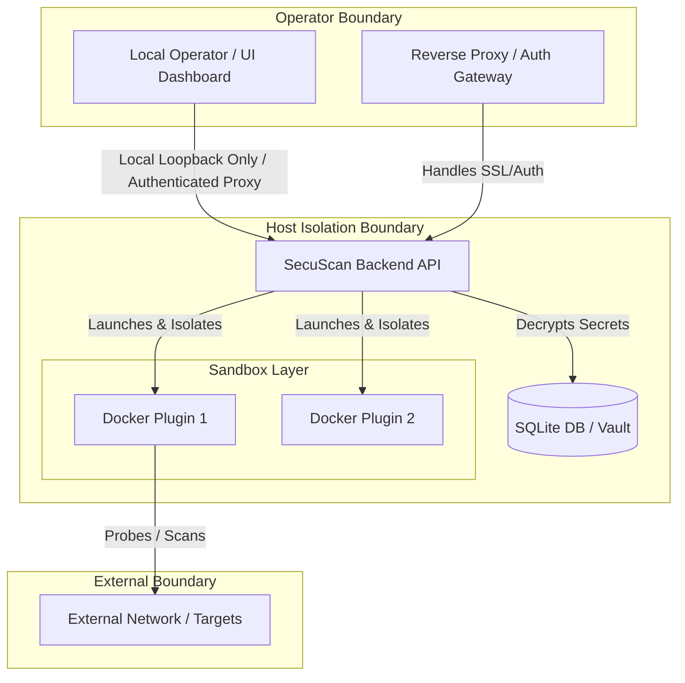

# SecuScan Secure Deployment Guide & Operator Threat Model

This document outlines the security architecture, trust boundaries, threat modeling, and secure deployment hardening procedures for operators deploying SecuScan in local, LAN, or containerized production environments.

As a high-powered pentesting and vulnerability scanning toolkit, SecuScan executes network operations, runs system commands, and stores highly sensitive credentials (API keys, target scopes, and vulnerability records). Standard security controls must be strictly maintained by the system operator.

---

## 1. Security Architecture & Trust Boundaries

SecuScan is designed with a **local-first** security philosophy. Out of the box, the backend acts as a single-user system running on loopback (`127.0.0.1:8000`) with no built-in multi-tenant authentication or isolation. When deploying, the operator must understand three core trust boundaries:



### The Three Trust Boundaries:

1.  **Operator to Backend Boundary**: The API exposes execution points that can run terminal commands via plugins. Access to this boundary must be restricted to authorized operators only. Placing the backend directly on a public IP without authentication is an immediate, critical vulnerability.
2.  **Backend to Sandbox Boundary**: The backend triggers third-party plugins. Because plugins evaluate system scopes and templates, they must be isolated (either via Docker containers or strict system permission policies) to prevent host compromise.
3.  **Sandbox to Network Boundary**: Scanners send packets to external targets. The outbound network flows must be governed by active guardrails (Safe Mode) to prevent self-scanning or unauthorized scanning of critical environments.

---

## 2. Operator Threat Model (STRIDE-based)

The following threat modeling table details operational risks, target boundaries, and respective mitigations:

| Threat Category | Specific Threat | Target Boundary | Impact | Mitigation / Configuration |
| :--- | :--- | :--- | :--- | :--- |
| **Spoofing (S)** | Unauthorized user accesses the API or hijacks an active operator session. | Operator to Backend | Attackers can launch unauthorized scans, edit secret values, or read audit logs. | Bind backend to `127.0.0.1:8000` only. In multi-user LANs, place behind an authenticating reverse proxy (Authelia/OAuth2) and enable `SECUSCAN_TRUSTED_PROXIES` for client rate limiting and identity resolution. |
| **Tampering (T)** | Compromised plugin or directory path traversal alters scanner output or inputs. | Backend to Sandbox | Malicious report generation, file injection, or database manipulation. | Enable plugin signature verification (`SECUSCAN_ENFORCE_PLUGIN_SIGNATURES=true`). Ensure `is_safe_path` validation is strictly enforced on path targets to prevent directory traversal. |
| **Repudiation (R)** | Operator performs intrusive scans or downloads secret vault keys without log generation. | Operator to Backend | Inability to track internal misuse, compromise, or unauthorized target scanning. | Backend automatically writes critical events (e.g. `task_created`, `task_completed`, `task_failed`) to the SQLite database audit log (`audit_log`). Retain and ship these logs off-host securely. |
| **Information Disclosure (I)** | Plaintext credential vault key leaks through public git repositories, environment dumps, or logs. | Host Isolation Boundary | Attackers can decrypt all stored third-party API keys, tokens, and sweep target credentials. | Enforce symmetric vault encryption by deriving a cryptographically strong 32-byte key from `SECUSCAN_VAULT_KEY`. Never use the default fallback in production. Ensure logs are sanitized and block raw target leaks in errors. |
| **Denial of Service (D)** | Intrusive scanning sweeps overwhelm target infrastructure or exhaust local host memory/CPU. | Sandbox to Network | Local system crashes due to high task concurrency, or scanner targets collapse, triggering legal action. | Configure `SECUSCAN_MAX_CONCURRENT_TASKS=3`. Apply `EndpointRateLimiter` dependencies to mutation (`task_start`, `vault`) and catalog endpoints to prevent abuse. Limit sandbox resource usage. |
| **Elevation of Privilege (E)** | Compromised plugin subverts shell templating, executing arbitrary commands as root on the host machine. | Backend to Sandbox | Full host compromise, data loss, and lateral movement in the hosting subnet. | Set `SECUSCAN_DOCKER_ENABLED=true` to force plugin sandboxing. Restrict container resources (`SECUSCAN_SANDBOX_CPU_QUOTA=0.5` and `SECUSCAN_SANDBOX_MEMORY_MB=512`) and run Docker in rootless mode. |

---

## 3. Local-Only Design vs. Network Exposure

By default, SecuScan is a **local single-operator utility**.

### Local-Only Topology (Recommended)
The backend binds to `127.0.0.1:8000`. The frontend communicates with it purely on loopback. Firewalls block port 8000 from all external interfaces.

### Remote / Team Server Topology
If you must host SecuScan on a central server for a security team:
1.  **DO NOT** expose `8000` to the internet or shared subnets directly.
2.  **DO NOT** configure the backend to bind to `0.0.0.0` without an upstream authenticating proxy.
3.  **DO** set up a reverse proxy (Nginx, Traefik, Apache) to terminate TLS and handle robust authentication (e.g., Basic Authentication, Authelia, or Keycloak).

---

## 4. Credential Vault & Key Management

SecuScan stores sensitive data—such as third-party API keys and secrets—encrypted inside its SQLite database using AES-256 in GCM mode (AEAD) via the Python `cryptography` library.

### Key Derivation & Cryptography Mechanics
1.  **AES-256-GCM Encryption**: Stored credentials are encrypted using `AESGCM` cryptography. Each encryption operation generates a unique random 12-byte nonce (initialization vector) to ensure cryptographic strength. The authentication tag (16 bytes, appended by GCM) provides confidentiality and absolute integrity; any ciphertext modification causes decryption to fail.
2.  **Deterministic Key Derivation**: During startup, the system reads the environment variable `SECUSCAN_VAULT_KEY` (or falls back to `SECUSCAN_PLUGIN_SIGNATURE_KEY`). It derives a deterministic 32-byte key using SHA-256:
    ```python
    seed = settings.vault_key or settings.plugin_signature_key
    digest = hashlib.sha256(seed.encode("utf-8")).digest()
    key = base64.urlsafe_b64encode(digest)
    ```
3.  **Zero-Tolerance Key Constraint**: In earlier development releases, the vault had an insecure fallback seed. In production-grade releases, **no hardcoded default exists**. If neither `SECUSCAN_VAULT_KEY` nor `SECUSCAN_PLUGIN_SIGNATURE_KEY` is defined in the environment, the backend will raise a `RuntimeError` and immediately crash at startup.

### How to Generate a Secure Vault Key
Generate a strong, unique high-entropy base64 key before starting the service:

**Option A: Using OpenSSL (Terminal)**
```bash
openssl rand -base64 32
# Output example: wL/f2Fm09r3j6K0A9XpLh6eU7rD5xN2yQ4j1k9v8c0o=
```

**Option B: Using Python**
```python
python3 -c "import secrets; print(secrets.token_urlsafe(32))"
```

Export this key to the environment before running the backend:
```bash
export SECUSCAN_VAULT_KEY="your-high-entropy-generated-token"
```

### Key Rotation Procedure
If you need to rotate your vault key:
1.  Stop the SecuScan service.
2.  Export the *old* key as `SECUSCAN_OLD_VAULT_KEY` and the *new* key as `SECUSCAN_VAULT_KEY`.
3.  Execute the migration command to decrypt and re-encrypt the database entries (or manually recreate the secrets).
4.  Remove the old key from the environment.

---

## 5. Client Identity Resolution & Endpoint Rate Limiting

SecuScan implements sophisticated, multi-factor rate limiting at the API route layer using a sliding window sliding history.

### Client Identity Resolution
The backend resolves the identity of requesting clients in a strict priority order:
1.  **API Key / Bearer Tokens**: Checks `X-API-Key` or `X-Key` headers, or standard `Authorization` headers (Bearer or Basic tokens). If found, the identity is registered as `apikey:<token>`.
2.  **Authenticated User Session**: Checks `X-User-ID` headers or request context state (`request.state.user_id`, `request.state.user`). If found, the identity is registered as `user:<user_id>`.
3.  **Client Connection IP**: Falls back to the connection IP (`ip:<ip>`). It respects the `X-Forwarded-For` HTTP header **only** if the immediate connection IP resides within the `SECUSCAN_TRUSTED_PROXIES` configuration array (default: `["127.0.0.1", "::1"]`).

### Route-specific Sliding Window Limiters
Four specific endpoint limiters protect resources and database access:
-   **Task Execution Rate (`task_start_limiter`)**: Restricts scan starts. Capped by default at 50 requests per hour (`SECUSCAN_RATE_LIMIT_TASK_START_LIMIT` & `SECUSCAN_RATE_LIMIT_TASK_START_WINDOW`).
-   **Vault Read/Write Rate (`vault_limiter`)**: Protects credential vaults from brute force. Capped by default at 15 requests per 60 seconds (`SECUSCAN_RATE_LIMIT_VAULT_LIMIT` & `SECUSCAN_RATE_LIMIT_VAULT_WINDOW`).
-   **Report Downloads (`report_download_limiter`)**: Restricts report extraction. Capped at 30 requests per 60 seconds (`SECUSCAN_RATE_LIMIT_REPORT_DOWNLOAD_LIMIT` & `SECUSCAN_RATE_LIMIT_REPORT_DOWNLOAD_WINDOW`).
-   **Read-Heavy Queries (`read_heavy_limiter`)**: Throttles intensive read actions. Capped at 100 requests per 60 seconds (`SECUSCAN_RATE_LIMIT_READ_HEAVY_LIMIT` & `SECUSCAN_RATE_LIMIT_READ_HEAVY_WINDOW`).

---

## 6. Plugin Integrity & Cryptographic Signatures

Plugins are powerful, dynamic, and execute local OS processes. SecuScan enforces strict integrity checks to prevent malicious plugin injections.

### Symmetric HMAC-SHA256 Signatures
Rather than using asymmetric GPG/RSA keys which require heavy keyrings, SecuScan validates plugin integrity via **symmetric HMAC-SHA256 signatures** using a shared secret key (`SECUSCAN_PLUGIN_SIGNATURE_KEY`):

1.  **Digest Computation**: The system calculates a deterministic SHA-256 hash of the plugin by:
    -   Encoding the canonical representation of `metadata.json` (sorting keys and stripping mutable fields like `checksum` and `signature`).
    -   Combining it with the SHA-256 hash of the plugin's `parser.py` code (after standardizing `\r\n` line endings to `\n` to maintain cross-platform hash reproducibility).
2.  **HMAC Authentication**: If `SECUSCAN_ENFORCE_PLUGIN_SIGNATURES` is true, the system computes `expected_sig = hmac.new(signature_key, combined_digest, hashlib.sha256)` and compares it against the signed checksum inside `metadata.json` using constant-time comparison (`hmac.compare_digest`).

### Time-of-Check to Time-of-Use (TOCTOU) Mitigation
A key vulnerability in dynamically loaded script systems is the TOCTOU window: a file is validated at startup but swapped with a malicious script right before execution.
-   SecuScan mitigates this by executing `verify_parser_at_exec_time` **immediately before** loading or executing the `parser.py` module.
-   It re-computes the parser file hash on disk and ensures it matches the loaded startup digest. If a mismatch is detected, execution is immediately aborted and logged as a high-severity security alert.

---

## 7. Sandbox Execution & Resource Isolation

By default, plugins execute directly as subprocesses on the host OS. To enforce process isolation and prevent sandbox escape:

### Docker Container Sandboxing
Setting `SECUSCAN_DOCKER_ENABLED=true` instructs the execution engine to run all standard scan commands inside ephemeral Docker containers.

-   **Process Isolation**: The command is wrapped and executed as `docker run --rm --name secuscan_task_{task_id} <docker_image>`. Standard CLI plugins run containerized.
-   **Resource Limits**: Hard quotas prevent CPU and memory exhaustion:
    -   `SECUSCAN_SANDBOX_CPU_QUOTA` (limits container CPUs, default: `0.5`).
    -   `SECUSCAN_SANDBOX_MEMORY_MB` (limits container RAM in megabytes, default: `512`).
-   **Execution Timeout**: Scans are bounded by standard asyncio timeouts (configured via `SECUSCAN_SANDBOX_TIMEOUT` or task `timeout` inputs). If a timeout occurs, the container is forcefully destroyed via `docker kill secuscan_task_{task_id}` to prevent zombie container leaks.
-   **Zero Volumes Shared**: Standard plugin containers run with no local volume mappings or socket shares, maximizing filesystem isolation.

---

## 8. Network Exposure Guardrails (Safe Mode)

SecuScan includes built-in network guardrails designed to prevent accidental target scanning or scanning of restricted infrastructure:

```bash
export SECUSCAN_SAFE_MODE_DEFAULT=true
```

When `Safe Mode` is enabled:
1.  **Strict RFC 1918 Private IP Enforcement**: Target IP addresses and CIDR ranges must reside within standard private subnets defined in the validator:
    -   `10.0.0.0/8`
    -   `172.16.0.0/12`
    -   `192.168.0.0/16`
    -   `127.0.0.0/8`
    Targets resolving to public IP addresses (e.g. `8.8.8.8`, `1.1.1.1`) are immediately rejected.
2.  **Top-Level Domain (TLD) Blocking**: Target domains ending in critical TLDs, specifically `.gov` and `.mil`, are automatically blocked at the validator layer before any command execution occurs.
3.  **Loopback Scan Controls**: Scans of the local host itself can be permitted or disabled globally by setting `SECUSCAN_ALLOW_LOOPBACK_SCANS` (default: `true`).

---

## 9. Task-Start Payload Validation

To protect the API backend from denial-of-service, request flooding, and buffer overflows, the `POST /tasks` (task-start) endpoint strictly enforces the following schema boundaries at the validation layer:
-   **Total Payload Size**: Capped at 64 KB (`SECUSCAN_TASK_START_MAX_BODY_BYTES`). Payloads exceeding this size return HTTP 413.
-   **String Length Restriction**: Individual text input values are capped at 1,000 characters (`SECUSCAN_TASK_START_MAX_FIELD_LENGTH`).
-   **Array Item Bounds**: List inputs are capped at 50 elements (`SECUSCAN_TASK_START_MAX_ARRAY_LENGTH`).
-   **No Echo Information Disclosure**: Error messages returned by the payload validator are sanitized to never echo back input contents, ensuring no sensitive tokens or oversized payloads leak into server logs.

---

## 10. Actionable Deployment Profiles

### Profile A: Local Desktop (Single User)
Best for standalone security researchers, running on a single laptop/workstation.

*   **Setup**: Binds purely to loopback. Docker sandboxing is enabled for plugin isolation.
*   **Environment File (`.env`)**:
    ```bash
    SECUSCAN_BIND_ADDRESS="127.0.0.1"
    SECUSCAN_BIND_PORT=8000
    SECUSCAN_DEBUG=false
    SECUSCAN_VAULT_KEY="generate-a-strong-32-byte-key"
    SECUSCAN_DOCKER_ENABLED=true
    SECUSCAN_ALLOW_LOOPBACK_SCANS=true
    SECUSCAN_SAFE_MODE_DEFAULT=true
    ```

---

### Profile B: Team LAN Server (Shared Subnet)
Best for internal security teams working within a local LAN.

*   **Setup**: Binds to local interface, behind an Nginx reverse proxy running Basic Authentication to prevent unauthorized access.
*   **Nginx Configuration Template (`/etc/nginx/sites-available/secuscan`)**:
    ```nginx
    server {
        listen 443 ssl http2;
        server_name secuscan.local;

        # TLS configuration
        ssl_certificate /etc/ssl/certs/secuscan.crt;
        ssl_certificate_key /etc/ssl/private/secuscan.key;
        ssl_protocols TLSv1.2 TLSv1.3;
        ssl_ciphers HIGH:!aNULL:!MD5;

        # Basic Auth block for team authentication
        auth_basic "SecuScan Restricted Access";
        auth_basic_user_file /etc/nginx/.htpasswd;

        location / {
            proxy_pass http://127.0.0.1:8000;
            proxy_set_header Host $host;
            proxy_set_header X-Real-IP $remote_addr;
            proxy_set_header X-Forwarded-For $proxy_add_x_forwarded_for;
            proxy_set_header X-Forwarded-Proto $scheme;

            # SSE streaming settings (critical for scan log streams)
            proxy_http_version 1.1;
            proxy_set_header Connection "";
            proxy_cache off;
            proxy_buffering off;
            chunked_transfer_encoding on;
            proxy_read_timeout 86400s;
        }
    }
    ```
*   **Environment File (`.env`)**:
    ```bash
    SECUSCAN_BIND_ADDRESS="127.0.0.1"
    SECUSCAN_BIND_PORT=8000
    SECUSCAN_TRUSTED_PROXIES="127.0.0.1" # Allows rate limiting to trace real IP behind proxy
    SECUSCAN_VAULT_KEY="generate-a-strong-32-byte-key"
    SECUSCAN_DOCKER_ENABLED=true
    SECUSCAN_ALLOW_LOOPBACK_SCANS=false # Prevent team members from scanning the host server
    SECUSCAN_SAFE_MODE_DEFAULT=true
    ```

---

### Profile C: Production Containerized (Docker Compose)
Best for scalable, clean container deployment.

*   **Setup**: Deploy backend and frontend containers with locked down read-only volumes and rate limits.
*   **Deployment Configuration (`docker-compose.yml`)**:
    ```yaml
    version: '3.8'

    services:
      backend:
        image: secuscan-backend:latest
        build:
          context: ./backend
          dockerfile: Dockerfile
        environment:
          - SECUSCAN_BIND_ADDRESS=0.0.0.0
          - SECUSCAN_BIND_PORT=8000
          - SECUSCAN_VAULT_KEY=your_generated_secret_here
          - SECUSCAN_DOCKER_ENABLED=true
          - SECUSCAN_SAFE_MODE_DEFAULT=true
          - SECUSCAN_ALLOW_LOOPBACK_SCANS=false
          - SECUSCAN_TRUSTED_PROXIES=10.0.0.0/8,172.16.0.0/12,192.168.0.0/16
        volumes:
          - /var/run/docker.sock:/var/run/docker.sock # Required if launching nested plugins
          - secuscan-data:/app/data
        ports:
          - "127.0.0.1:8000:8000" # Expose ONLY to loopback on host
        restart: unless-stopped
        networks:
          - secuscan-net

    volumes:
      secuscan-data:

    networks:
      secuscan-net:
        driver: bridge
    ```

---

## 11. Operator Hardening Checklist

Before deploying SecuScan in a shared or active scanner environment, run through this pre-flight checklist:

- [ ] **Symmetric Encryption Key Derived**: Ensure `SECUSCAN_VAULT_KEY` is set to a unique, high-entropy 32-byte token (Generated via OpenSSL or Secrets library).
- [ ] **Bind Address Locked Down**: Confirm the service binds to loopback (`127.0.0.1`) rather than `0.0.0.0` unless placed directly behind a firewalled proxy.
- [ ] **SSL/TLS Active**: If exposed to a LAN, confirm the reverse proxy terminates connection with modern TLS configurations (TLS 1.2 or 1.3 only).
- [ ] **Authentication Enabled**: Confirm Nginx basic auth or an authentication wrapper (Authelia, Keycloak) prevents unauthorized entry to port 8000/443.
- [ ] **Docker Socket Isolated**: If `SECUSCAN_DOCKER_ENABLED` is true, run Docker in rootless mode on the host to avoid container escape risks.
- [ ] **Limits Enforced**: Ensure endpoint rate limiters are active to prevent scan/auth abuse under high concurrency.
- [ ] **Target Scope Defined**: Confirm `SECUSCAN_SAFE_MODE_DEFAULT` is active for untrusted operator environments to protect external networks.
- [ ] **Audit Logging Preserved**: Set SQLite database permissions such that only the backend process can write to `secuscan.db` and audit logs are regularly monitored.
